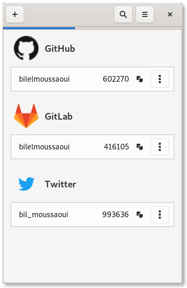

# Authenticator

Two-factor authentication application built for GNOME.

## Screenshots

## Features

- QR code scanner
- Beautiful UI
- Huge database of more than 560 supported services
- Keep your PIN tokens secure by locking the application with a password
- Automtically fetch an image for services using their favicon
- The possibility to add new services

## Hack on Authenticator
To build the development version of Authenticator and hack on the code
see the [general guide](https://wiki.gnome.org/Newcomers/BuildProject)
for building GNOME apps with Flatpak and GNOME Builder.

You are expected to follow our [Code of Conduct](/code-of-conduct.md) when participating in project
spaces.

## Credits

- We ship a database of providers based on [twofactorauth](https://github.com/2factorauth/twofactorauth), by the 2factorauth team
