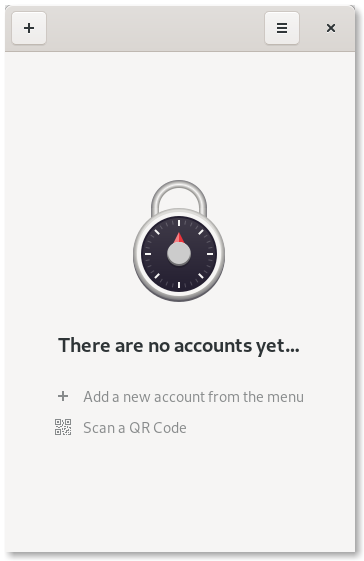

# Authenticator

Two-factor authentication code generator for GNOME. Created with love using Python and GTK+.

## Screenshots

## Features

- QR code scanner
- Beautiful UI
- Huge database of more than 500 supported services
- Keep your 2FA pin's secure by locking the application with a password

## Hack on Authenticator
To build the development version of Authenticator and hack on the code
see the [general guide](https://wiki.gnome.org/Newcomers/BuildProject)
for building GNOME apps with Flatpak and GNOME Builder.

## Dependecies

- `Python 3.3+`
- `Gtk 3.16+`
- `meson 0.48`
- `ninja`
- `pyotp`
- `libsecret`
- `Pillow`
- `zbar`
- `pyzbar`

## Flags

- `--version`
  Shows the version number of the application
- `--debug`
  Enable the debug logs

## Credits

- Database for applications/websites from [twofactorauth](https://github.com/2factorauth/twofactorauth), by the 2factorauth team
